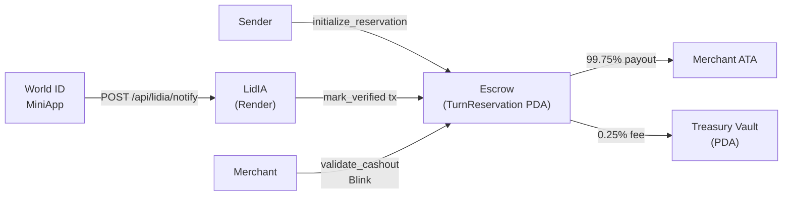

# Remesa LiquidezIA

> Mesa LATAM por turnos en Solana (Anchor): escrow + whitelist de comercios + fee al tesoro. Frontend Next.js en Vercel con Solana Actions (devnet). Backend LidIA en Render con World ID + ElevenLabs + WhatsApp.

---

## El problema

En remesas y pagos locales de LATAM, tres cosas fallan sistemáticamente:

- **Confianza y orden** — no hay regla pública sobre quién cobra cuándo en un grupo de comercios o rutas recurrentes.
- **Comisiones opacas** — el fee es una promesa off-chain, nunca verificable por el receptor.
- **Integración práctica** — el receptor tiene que abrir una app específica; el comerciante no puede simplemente escanear un código desde su wallet.

**Remesa LiquidezIA** resuelve esto con un contrato Anchor que hace cumplir las reglas on-chain: turno reservado, verificación opcional (World ID), cashout con split de fee determinístico, y una capa HTTPS/Actions para que cualquier wallet pueda ejecutar el flujo.

---

## Cómo funciona



1. **Sender** bloquea SPL tokens en un vault PDA con `initialize_reservation`.
2. **World ID** valida la identidad del receptor; el backend LidIA firma `mark_verified` on-chain.
3. **Merchant** escanea el Blink del receptor → firma `validate_cashout` → recibe el 99.75%; el 0.25% va al tesoro del protocolo.
4. El admin puede drenar el tesoro con `withdraw_treasury` (admin-only).

---

## Stack tecnológico

| Capa | Tecnología |
|---|---|
| Contrato | Rust · Anchor `0.32` |
| Cliente TS | `@coral-xyz/anchor` · `@solana/web3.js` |
| Frontend / Actions | Next.js 14 · Vercel · `@solana/actions` |
| Backend IA | Node.js · Render · ElevenLabs · World ID |
| Red | Solana **devnet** (program ID abajo) |

---

## Estructura del monorepo

```
remesa-liquidez/
├── programs/          # Programa Anchor (Rust)
│   └── remesa-liquidez/src/
│       ├── lib.rs                  # entry point — 8 instrucciones
│       └── instructions/           # módulo por instrucción
├── web/               # Next.js + Solana Actions → Vercel
│   ├── app/
│   │   ├── page.tsx                # landing
│   │   ├── actions.json/route.ts   # manifest Blinks
│   │   └── api/actions/
│   │       ├── verify/route.ts     # mark_verified Blink
│   │       └── cashout/route.ts    # validate_cashout Blink
│   ├── lib/
│   │   ├── anchor.ts               # program client (read-only)
│   │   ├── pdas.ts                 # derivación de PDAs
│   │   └── instructions.ts        # buildMarkVerifiedIx helper
│   ├── idl/                        # IDL JSON commiteado
│   └── types/                      # tipos TS generados por Anchor
├── backend/           # Backend LidIA (Render) — pendiente scaffold
├── client/            # Helpers TS para scripts y tests
├── scripts/           # E2E devnet · register merchants
├── tests/             # Anchor tests (mocha/chai)
├── migrations/        # initialize_config bootstrap
├── .env.example       # Vars unificadas (fuente de verdad)
└── Anchor.toml
```

---

## Inicio rápido

### Prerrequisitos

- Rust + Anchor CLI `0.32`
- Solana CLI (cluster devnet)
- Node.js ≥ 20 · Yarn

### Instalación

```bash
# Dependencias raíz (Anchor + scripts)
yarn install

# Dependencias del frontend
cd web && npm install && cd ..
```

### Variables de entorno

```bash
cp .env.example .env
# Editar .env con tus valores reales
npm run sync-env          # propaga a web/.env (y backend/.env cuando exista)
```

### Compilar y testear el programa

```bash
anchor build
anchor test
```

### E2E en devnet (mint → reserve → verify → cashout)

```bash
npm run e2e:devnet
```

El script imprime las tx signatures y el split fee verificado al final.

### Frontend local

```bash
cd web && npm run dev
# → http://localhost:3000
```

### Deploy a Vercel

```bash
cd web && vercel deploy --prod --yes --scope <tu-scope>
```

---

## Endpoints en producción

| Recurso | URL |
|---|---|
| Demo / Landing | `https://web-coral-pi-66.vercel.app` |
| Actions manifest | `https://web-coral-pi-66.vercel.app/actions.json` |
| Verify Action | `https://web-coral-pi-66.vercel.app/api/actions/verify?pda=<PDA>` |
| Cashout Action | `https://web-coral-pi-66.vercel.app/api/actions/cashout?pda=<PDA>` |
| Backend LidIA | `https://remesa-blink-backend.onrender.com` |
| Stores (liquidez) | `https://remesa-blink-backend.onrender.com/api/pricing/stores` |

### Blink URLs amigables

```
# Sender aprueba verificación World ID
https://web-coral-pi-66.vercel.app/verificar/<reservationPda>

# Receptor presenta al cajero para cobrar
https://web-coral-pi-66.vercel.app/remesa/<reservationPda>
```

---

## Program ID — devnet

```
Fprb6jTLfjXfZ6yuWzS7LVXxwVvPbPgPZiEqDEL9bRfj
```

[Ver en Solscan devnet →](https://solscan.io/account/Fprb6jTLfjXfZ6yuWzS7LVXxwVvPbPgPZiEqDEL9bRfj?cluster=devnet)

### Instrucciones del programa

| Instrucción | Quién firma | Efecto |
|---|---|---|
| `initialize_reservation` | Sender | Bloquea tokens en vault PDA |
| `mark_verified` | Sender | Vira `is_verified = true` |
| `validate_cashout` | Merchant | Libera vault; split 99.75/0.25 |
| `cancel_reservation` | Receiver (o Sender post-expiry) | Reembolso |
| `register_merchant` | Admin | Agrega a whitelist |
| `set_merchant_status` | Admin | Activa/desactiva merchant |
| `initialize_config` | Admin | Bootstrap Config PDA |
| `withdraw_treasury` | Admin | Drena fees acumulados |

---

## Variables de entorno

Copiar `.env.example` → `.env` y rellenar:

| Variable | Necesaria en | Descripción |
|---|---|---|
| `SOLANA_CLUSTER` | web · backend | `devnet` o `mainnet-beta` |
| `SOLANA_RPC_URL` | web · backend | URL del RPC HTTPS |
| `PROGRAM_ID` | backend | Program ID del contrato |
| `SENDER_AUTHORITY_SECRET_KEY` | **solo backend** | Keypair JSON (64 bytes) que firma `mark_verified` |
| `BLINK_BASE_URL` | backend | Base URL de Vercel para construir Blink URLs |
| `NEXT_PUBLIC_BLINK_BASE_URL` | web | Igual que arriba, expuesta al browser |
| `RENDER_BACKEND_URL` | web | URL del backend de Render |
| `ELEVENLABS_API_KEY` | backend | API key de ElevenLabs |
| `WORLD_ID_APP_ID` | backend | App ID de World ID |

> `SENDER_AUTHORITY_SECRET_KEY` **nunca** debe estar en Vercel ni commiteado en el repo.

---

## Licencia

ISC
