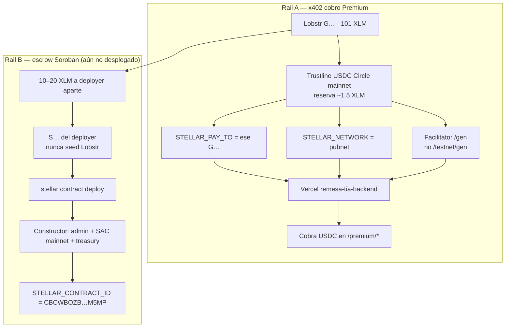

# Deploy — Remesa TIA (holatia.app)

Backend TIA en **Vercel** (`remesa-tia-backend`). Frontend Next.js en **otro** proyecto Vercel (`web` / web-coral-pi-66). El bot Baileys sigue en Render (o un túnel público).

## 1. Backend TIA — Vercel `remesa-tia-backend`

Root Directory = `backend`. Adapter: `backend/api/index.ts` (`export default createApp()`, sin `listen`). Config: `backend/vercel.json`.

**Environment** (en este proyecto, **sin `PORT`** y **sin `STELLAR_TESTNET_SECRET`**):

| Variable | Valor |
|----------|-------|
| `BOT_INTERNAL_URL` | URL **pública HTTPS** del bot (`https://remesa-blink-bot.onrender.com` o un túnel). **Nunca localhost** — Vercel no alcanza WSL |
| `BOT_INTERNAL_SECRET` | Mismo secret que el bot Baileys. Secret sin URL pública = 502 igual |
| `TIA_MANUAL_OVERRIDE_SECRET` | Override manual WhatsApp |
| `BLINK_BASE_URL` | `https://web-coral-pi-66.vercel.app` |
| `NIRIUM_X402_ENABLED` | `true` (premium API) |
| `STELLAR_PAY_TO` | `G…` **de la misma red** que `STELLAR_NETWORK`, con trustline USDC |
| `X402_FACILITATOR_API_KEY` | Testnet: [channels.openzeppelin.com/testnet/gen](https://channels.openzeppelin.com/testnet/gen) |
| `STELLAR_NETWORK` | `testnet` (o `pubnet` / `mainnet` solo con payTo + facilitator de mainnet) |

Producción: `https://remesa-tia-backend.vercel.app`

```bash
curl -sS https://remesa-tia-backend.vercel.app/health
curl -i https://remesa-tia-backend.vercel.app/premium/fx   # → 402
```

`STELLAR_TESTNET_SECRET` **no va a Vercel**. Solo en `.env` local para `npm run x402:smoke`. Quien tenga el dashboard podría firmar pagos.

### Mainnet / pubnet (no es rotar la key)

Hace falta **todo** esto a la vez:

1. `STELLAR_NETWORK=pubnet` (o `mainnet`)
2. `STELLAR_PAY_TO` = cuenta **mainnet** `G…` con trustline USDC (reserva ~1.5 XLM de los 101)
3. `X402_FACILITATOR_API_KEY` de [channels.openzeppelin.com/gen](https://channels.openzeppelin.com/gen) — **no** la de `/testnet/gen`

Mezclar el `GAAXQWE6…` de testnet con `stellar:pubnet` **no cobra**.

101 XLM alcanzan. El `G…` de Lobstr cobra x402; **no** firma el escrow. Dos rieles:



| Pieza | Testnet (hoy) | Mainnet |
|-------|---------------|---------|
| `STELLAR_PAY_TO` | `GAAXQWE6…` | `G…` Lobstr |
| Facilitator | `/testnet/gen` | `/gen` |
| USDC | SAC `CBIELTK6…` | Circle mainnet `GA5ZSEJY…KZVN` |
| Secret de pago | `.env` local | `.env` local — **nunca** Vercel |

## 2. Frontend — Vercel `web` (web-coral-pi-66)

`RENDER_BACKEND_URL` vive **aquí**, no en `remesa-tia-backend`:

```
RENDER_BACKEND_URL=https://remesa-tia-backend.vercel.app
```

Redeploy production del proyecto `web`.

## 3. Bot WhatsApp (remesa-blink-bot)

URL pública (Render o túnel). Si está offline:

1. Shell del servicio bot
2. Re-escanear QR WhatsApp
3. `BOT_INTERNAL_SECRET` igual en bot y en `remesa-tia-backend`

## 4. Smoke

```bash
# Desde raíz monorepo (cliente x402: secret solo local)
npm run e2e:devnet
RENDER_BACKEND_URL=https://remesa-tia-backend.vercel.app npm run x402:smoke
npm run backend:smoke -- 521234567890
```

## Troubleshooting

| Síntoma | Fix |
|---------|-----|
| `502 fetch failed` | Bot offline, `BOT_INTERNAL_URL` localhost, o Vercel no alcanza el bot |
| `401 Unauthorized` | `BOT_INTERNAL_SECRET` mismatch |
| `400 Payload inválido` | userWA sin +, mínimo 10 dígitos |
| Frontend sigue en Render 404 | `RENDER_BACKEND_URL` en el proyecto **web**, no en el backend |
| x402 402 en testnet, 0 cobros en pubnet | payTo testnet + `stellar:pubnet`, o facilitator `/testnet/gen` en mainnet |

## Manual override — WhatsApp

```bash
curl -X POST https://remesa-tia-backend.vercel.app/api/tia/manual-notify \
  -H "Authorization: Bearer $TIA_MANUAL_OVERRIDE_SECRET" \
  -H "Content-Type: application/json" \
  -d '{
    "walletSolana": "BsuHTPQxWPyiToz8fZcrP2STGripLmbAaT11AezwBaw",
    "userWA": "521234567890",
    "amountUSDC": 10,
    "isVerified": true,
    "reservationPda": "<PDA>"
  }'
```
