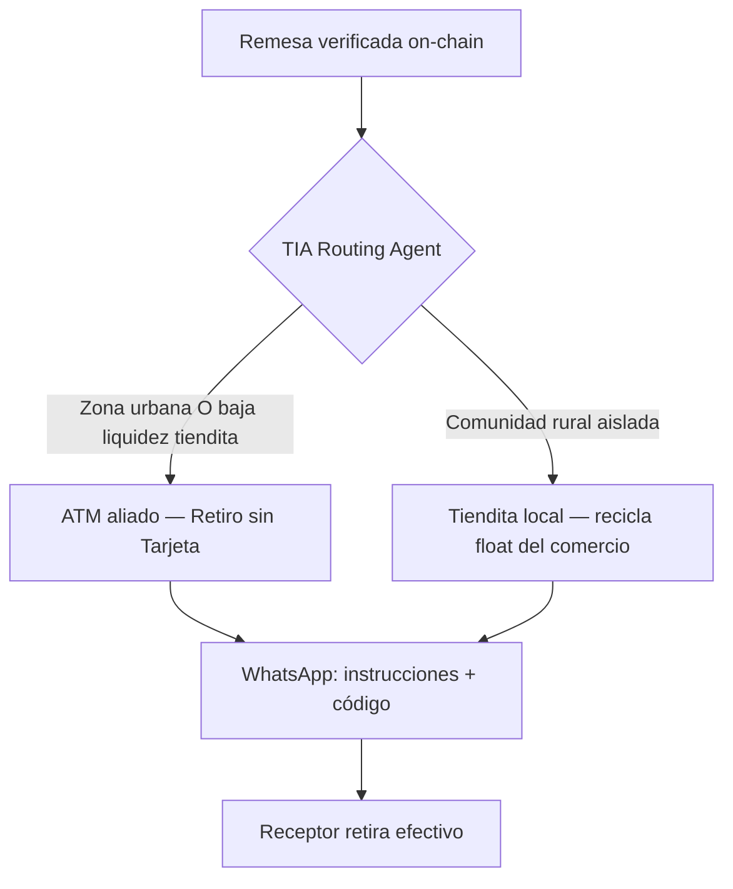

# Modelo Híbrido de Enrutamiento Dinámico — TIA

> Bridge Dev3pack · Positioning estratégico · Vanina/Ginevra + Leopold  
> **Principio:** No sustituir tienditas por cajeros — **orquestar ambos** según liquidez y geografía.

---

## One-liner (memoria test)

> **"Mandas $100 a México. TIA decide si tu familia retira en el cajero aliado más cercano o en la tiendita de la esquina — y le avisa por WhatsApp. Tú pagas 25 centavos, no siete dólares."**

---

## Qué es TIA (para Bridge)

Remesa TIA **no es una app de remesas**. Es una **capa agéntica de optimización de liquidez transfronteriza** que conecta blockchain con **cualquier infraestructura física disponible** en LATAM: tienditas, ATMs, y futuros partners (corresponsales, Oxxo, etc.).

| Generic (no) | Specific (sí) |
|--------------|---------------|
| Infra DeFi para remesas LATAM | TIA elige dónde cobrar: cajero o tiendita |
| Protocolo de cash-out on-chain | WhatsApp + efectivo en el punto con más liquidez |
| Routing algorithm v2 | "Tu mamá va al cajero en Polanco o a la tienda en Oaxaca" |

---

## Reglas de enrutamiento

### Ruta A — ATM (Retiro sin Tarjeta)

**Cuándo:**
- Zona urbana con densidad de cajeros aliados
- Tienditas locales con **balance de liquidez bajo** (no pueden absorber el monto)
- Horario nocturno / domingo donde comercios cerrados y ATM disponible

**Qué recibe el receptor (WhatsApp):**
> *"Tu remesa de $100 está lista. Retira sin tarjeta en el cajero [marca] a 400m — código: XXXX. Válido 24h."*

**Valor para Bridge:** Demuestra que TIA **no depende de un solo rail físico** — escala en CDMX, Guadalajara, Monterrey.

### Ruta B — Tiendita local

**Cuándo:**
- Comunidad rural o periurbana **sin ATM** cercano
- Comercio aliado con **float suficiente** para el monto
- Preferencia cultural: confianza en la *tiendita* del barrio

**Qué recibe el receptor (WhatsApp):**
> *"Tu remesa está lista. Pasa a **Tiendita La Esperanza** (Av. Juárez 12) con este código. El dueño te paga en efectivo."*

**Valor para Bridge:** Recicla efectivo del comercio — **last-mile donde nadie más llega**. No compite con bancos; complementa.

---

## Señales de decisión (agente TIA)

| Señal | Fuente | Peso |
|-------|--------|------|
| Geografía receptor | WhatsApp / código postal / GPS opt-in | Alto |
| Liquidez tiendita | Balance on-chain del merchant ATA + límite diario | Alto |
| Monto remesa | Escrow amount | Medio |
| Horario | Local time MX | Medio |
| Densidad ATM | Catálogo partners (manual Sem 2 → API Sem 3+) | Medio |

**Bridge MVP (devnet):** routing **manual documentado** o hardcoded por zona piloto.  
**Post-Bridge:** agente automático con overrides manuales (Do Things That Don't Scale).

---

## Pirámide narrativa (Problem → Why You)

### 1. PROBLEM
Enviar $100 US→MX cuesta $7 y tarda días. El receptor no tiene banco. Incluso cuando el dinero "llega", **no hay liquidez física** donde vive: o la tiendita no tiene efectivo, o no hay cajero cerca.

### 2. INSIGHT
El last-mile no es un problema de pagos — es un problema de **liquidez física distribuida**. Urbano necesita densidad (ATMs). Rural necesita confianza (tienditas). **Nadie enruta entre ambos.**

### 3. MECHANISM
USDC en escrow → **TIA enruta** hacia ATM o tiendita → WhatsApp con instrucciones → efectivo en mano. Fee 0.25% on-chain.

### 4. WHY NOW
- Stablecoins + Solana Blinks = settlement instantáneo
- Retiro sin tarjeta maduro en redes ATM MX
- WhatsApp = canal universal sin app
- AI agents = decisión de ruta en tiempo real (Sem 3+)

### 5. WHY YOU
Top 3 hackathon MX · Bridge #43 LATAM · flujo E2E tiendita **ya demo-able** · visión híbrida lista para pilotos urbano + rural.

---

## Messaging por audiencia Bridge

### Para mentores GTM (Leopold / Tochukwu)
*"TIA es el Uber Eats de la liquidez remesas: no cocina (no custodia), enruta al mejor punto de entrega físico."*

### Para mentores Ops (Sylvain)
*"Dos rails, un contrato: misma tx on-chain, distinto settlement físico. Runbook separado por rail."*

### Para legal (Yarden)
*"Tiendita = agente de pago local. ATM = partner B2B retiro sin tarjeta. Mismo disclosure al receptor vía WhatsApp."*

### Para fundraising (Ivan)
*"TAM = $60B US→MX. Moat = grafo de liquidez física + routing agent, no solo fee bajo."*

---

## Fases de implementación

| Fase | Cuándo | Qué demostrar |
|------|--------|---------------|
| **Bridge MVP** | Jun–Jul 2026 | Rail tiendita E2E devnet (Blink + WhatsApp) |
| **Pilot urbano** | Q3 2026 | 1 ATM partner + routing manual urbano |
| **Pilot rural** | Q3 2026 | 2 tienditas Oaxaca/GDL periurbano |
| **Agente automático** | Q4 2026 | Señales liquidez + geo → ruta sin humano |

---

## Demo Bridge (qué mostrar en vivo)

1. **Hoy (devnet):** flujo tiendita completo — reserva → verify → WhatsApp Blink → cashout merchant
2. **Narrar en voz:** *"En producción, TIA hubiera enrutado a ATM porque la tiendita X tiene liquidez baja"*
3. **Slide backup:** diagrama de routing + screenshot WhatsApp mock ATM vs tiendita

---

## Relación con SPEC.md

- **IN scope Bridge:** tiendita + WhatsApp + 1 E2E (no bloquear por ATM)
- **Post-MVP:** ATM cardless API, geo routing, balance oracle tienditas
- **Nunca cortar Bridge:** WhatsApp + 1 flujo E2E + entrevistas

Ver [positioning-messaging.md](./positioning-messaging.md) · [narrative-pyramid.md](./narrative-pyramid.md)
